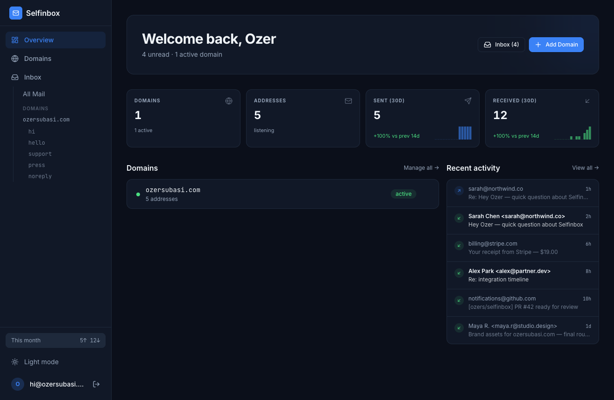
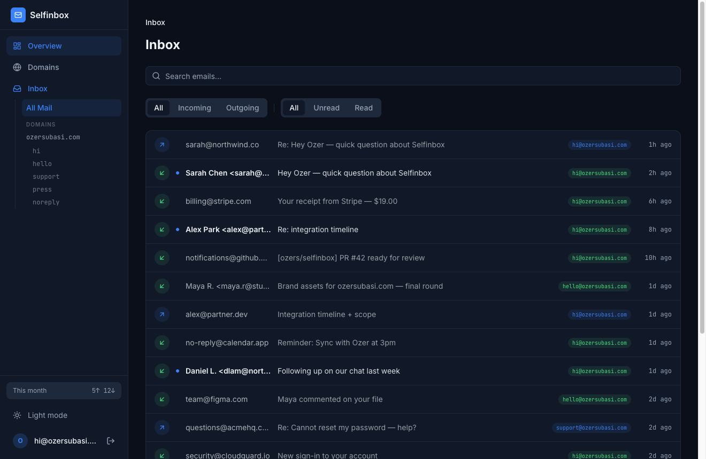
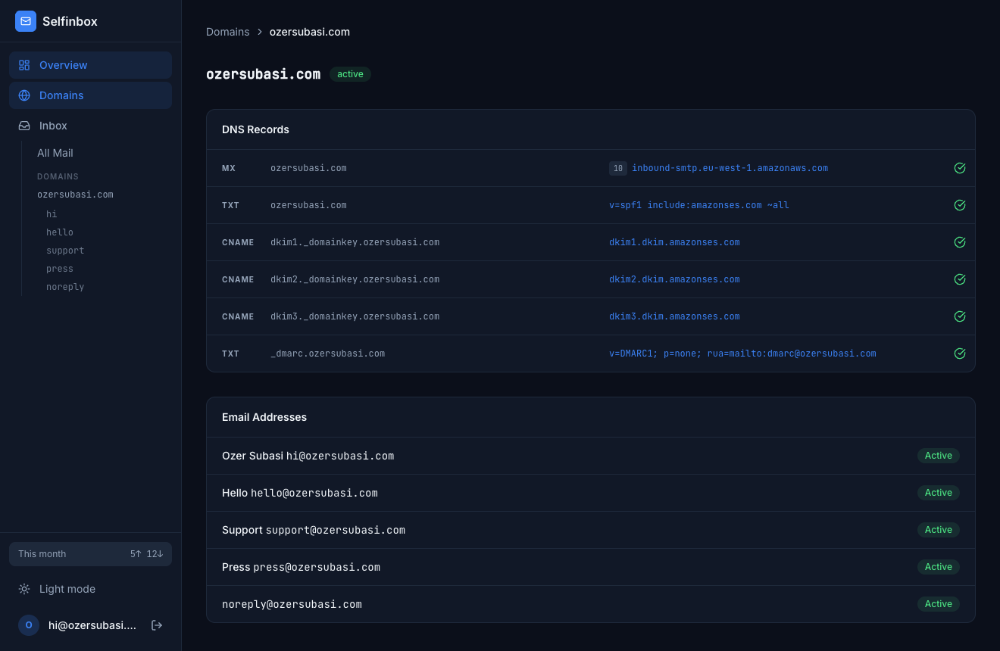

<h1 align="center">
  <a href="https://github.com/ozers/selfinbox">
    Selfinbox
  </a>
</h1>

<p align="center">
  <strong>Run your own email service on AWS in an afternoon</strong><br>
  <sub>Send and receive mail at any number of <code>you@yourdomain.com</code> addresses — with a web inbox, per-domain SMTP credentials, and automatic DKIM/SPF/DMARC</sub>
</p>

<p align="center">
  <a href="LICENSE"></a>
  <a href="https://nodejs.org/"></a>
  <a href="https://www.typescriptlang.org/"></a>
  <a href="https://www.postgresql.org/"></a>
  <a href="https://aws.amazon.com/ses/"></a>
  <a href="https://www.docker.com/"></a>
</p>

<p align="center">
  <a href="https://selfinbox.ozersubasi.com">🌐 Landing Page</a> •
  <a href="#quick-start">🚀 Quick Start</a> •
  <a href="#features">✨ Features</a> •
  <a href="docs/SELF_HOSTING.md">📖 Self-Hosting</a> •
  <a href="docs/ARCHITECTURE.md">🏗️ Architecture</a> •
  <a href="docs/DEPLOY.md">📦 Deploy</a> •
  <a href="docs/AWS_SETUP.md">☁️ AWS Setup</a> •
  <a href="docs/AI_SETUP.md">🤖 AI Setup</a>
</p>

---

<p align="center">
  
</p>
<p align="center">
  
  
</p>
<p align="center">
  <sub><a href="https://selfinbox.ozersubasi.com/demo">↗ Try the live demo</a> — sample data, no signup</sub>
</p>

## What is this

A thin, open-source app on top of **AWS SES**. SES handles the hard parts (delivery, reputation, DKIM signing); Selfinbox gives you the UI, multi-domain plumbing, Postgres state, and a one-shot script that wires it all together.

The privacy of self-hosting — your data, your DB, your domain — without running an MTA.

Use it for:

- Custom-domain inboxes for personal projects (`hello@mysidehustle.com`)
- App transactional email with per-app SMTP credentials
- Family / small-team shared infra — one deploy, many users, many domains
- Forwarding-only setups (`*@yourdomain.com` → your real inbox)

> 🏭 Used in production · 🧩 Single-process deploy · 🪶 No queue, no Redis

## Features

- **Receive** — SES → S3 → SNS webhook, parsed and stored. Per-address forwarding and per-domain catch-all.
- **Send** — compose from the web inbox or via per-domain SMTP credentials (Gmail "Send as", Apple Mail, Thunderbird guides included).
- **Auto DNS** — generates MX / SPF / DKIM / DMARC per domain, polls until verified. Optional one-click Cloudflare provisioning.
- **Dashboard** — unread counts, 14-day sparklines, recent activity, pending-verification banners.
- **Bounces & complaints** — wired to SES notifications; hard bounces auto-deactivate addresses.
- **Multi-tenant** — users, domains, addresses, catch-alls isolated by `user_id`.
- **Single process** — one Node server, Postgres, AWS. No queue, no Redis.

## What you'll need

- An **AWS account** — free tier is fine; a personal inbox typically runs **under $1/month** (SES is $0.10 per 1,000 emails, first 1,000 received/month free).
- A **domain** you can add DNS records to (any registrar).
- **Docker** — or Node 22+ if you'd rather run it directly.

That's the whole list. `setup-aws.sh` provisions everything in your AWS account for you, and the dashboard generates the exact DNS records to paste. Budget ~an hour the first time, most of it just waiting on DNS. Not a terminal person? Hand [`docs/AI_SETUP.md`](docs/AI_SETUP.md) to an AI agent and it'll do the install for you.

## Quick start

Docker + AWS account:

```bash
git clone https://github.com/ozers/selfinbox && cd selfinbox
./scripts/init.sh --env-only           # writes .env + JWT_SECRET (no Node needed on host)
# edit apps/api/.env → set FROM_EMAIL (Postgres is bundled by compose)
./scripts/setup-aws.sh                 # also writes AWS keys + bucket into .env
docker compose up --build -d
docker compose run --rm app node scripts/create-user.mjs
```

Open <http://localhost:3001> → add a domain in the dashboard → paste the generated DNS records at your registrar → done.

> ⚠️ Run `setup-aws.sh` as an **IAM user, not the account root** (it refuses root) — it needs an admin or the scoped [provisioner policy](docs/iam-provisioner-policy.json).

**Full setup** — prerequisites, the Node (non-Docker) path, SES sandbox notes, DNS verification, and troubleshooting — lives in **[`docs/SELF_HOSTING.md`](docs/SELF_HOSTING.md)**. Deploying to a host? See [`docs/DEPLOY.md`](docs/DEPLOY.md).

> 🤖 **Rather not touch a terminal?** Hand [`docs/AI_SETUP.md`](docs/AI_SETUP.md) to Claude Code / Cursor — it's a step-by-step runbook the agent follows to install Selfinbox for you, stopping only for what it can't do (your AWS keys, DNS edits).

## Architecture

```
┌────────────┐    ┌──────────────────┐    ┌───────────────┐
│ React SPA  │───▶│ Hono API (Node)  │───▶│  Postgres     │
└────────────┘    └────────┬─────────┘    └───────────────┘
                           │ AWS SDK
                           ▼
              ┌────────────────────────────┐
              │ SES (send + receive)       │
              │ S3  (inbound raw email)    │
              │ SNS (inbound + bounces)    │
              └────────────────────────────┘
```

- `apps/api` — Hono server (Node 22+), serves API + built frontend
- `apps/web` — React SPA (Vite, Tailwind v4, React Router)
- `scripts/setup-aws.sh` — idempotent AWS provisioner (S3 + SNS + IAM + SES rule set)

How the inbound SES → S3 → SNS → webhook pipeline works (and the security model behind it): **[`docs/ARCHITECTURE.md`](docs/ARCHITECTURE.md)**.

## Contributors

<a href="https://github.com/ozers/selfinbox/graphs/contributors">
  
</a>

## Star History

<a href="https://star-history.com/#ozers/selfinbox&Date">
  <picture>
    <source media="(prefers-color-scheme: dark)" srcset="https://api.star-history.com/svg?repos=ozers/selfinbox&type=Date&theme=dark" />
    <source media="(prefers-color-scheme: light)" srcset="https://api.star-history.com/svg?repos=ozers/selfinbox&type=Date" />
    
  </picture>
</a>

## Contributing

Issues and PRs welcome. The project deliberately stays small — please skim
[`CONTRIBUTING.md`](CONTRIBUTING.md) before sending a non-trivial PR so we
don't reject work you put hours into. For usage questions, prefer
[Discussions](https://github.com/ozers/selfinbox/discussions) over issues.

## Security

Please **don't** open public issues for vulnerabilities — see
[`SECURITY.md`](SECURITY.md) for the disclosure email and what's in/out
of scope.

## License

MIT — see [LICENSE](LICENSE).
